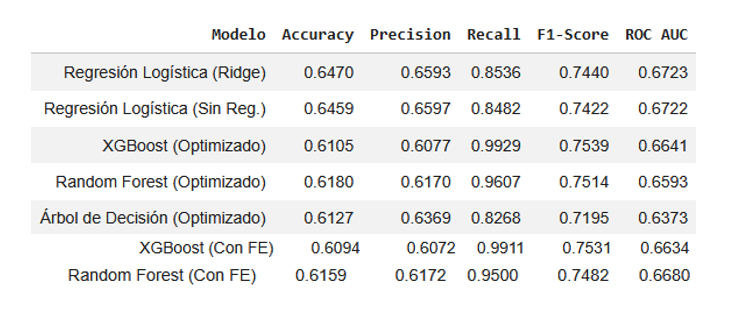

# SP1668-Proyecto-3
El presente repositorio detalla los pasos para la obtención de una aplicación que permita identificar Data Drifting en un modelo XGBoost con base en datos de diabetes.

# Tabla comparativa

La tabla de la imagen compara las métricas de los modelos con los cambios aplicados en la retroalimentación, y con Feature Engineering (FE) o Enriquecimiento de datos.

Se determina que el mejor modelo es XGBoost con datos originales.

# Cuadernos de trabajo

El archivo  **Fases.ipynb** contiene el código de ejecución de modelos con datos limpios originales y con datos enriquecidos (descripción de nuevas variables en el archivo). El archivo **Modelo_final.ipynb** contiene el código para guardar los objetos *.joblib* para la ejecución de la aplicación (*app.py*) de Data Drift a partir de Python. Los pasos para crear esta aplicación a partir de Antigravity se especifican en la siguiente sección.

# Bitácora de Co-creación y Registro de Prompts: Proyecto Antigravity (App MLOps & Data Drift)

Este documento detalla el proceso iterativo de diseño, desarrollo e implementación de la aplicación interactiva en Streamlit. La aplicación fue co-creada utilizando el editor con IA integrada **Cursor**, siguiendo una metodología guiada por un rol de **Ingeniero de Software Senior y Experto en MLOps**.

---

## 🛠️ Fase 1: Ingeniería de Prompts y Configuración Inicial

Para garantizar la modularidad y escalabilidad del proyecto, se estableció un marco de trabajo estricto con la IA, exigiéndole entrar en **"Planning Mode"** antes de generar cualquier línea de código de producción.

### Prompt Semilla (Inicial)
> **Prompt:** *"Actúa como un Ingeniero de Software Senior y experto en Machine Learning Ops (MLOps). Mi objetivo es desarrollar una aplicación web interactiva local y gratuita utilizando Python (preferiblemente con Streamlit) para poner en producción un modelo predictivo de Machine Learning y evaluar su comportamiento ante el Data Drift. IMPORTANTE: Antes de escribir cualquier código, DEBES entrar en "Planning Mode" (Modo de Planificación). Quiero que primero investiguues si es necesario, analices los requerimientos que te doy abajo y generes un documento de plan de implementación paso a paso (implementation_plan). No empieces a programar hasta que yo apruebe el plan. Si tienes dudas sobre la arquitectura o las dependencias, hazme las preguntas necesarias. [Se incluyeron los requisitos de Estructura, UI, Pestaña 1 de Predicción Individual, Pestaña 2 del Laboratorio de Data Drift con semáforo y especificaciones de los artefactos .joblib]."*

### Análisis y Decisiones de Arquitectura Co-creadas:
La IA analizó los metadatos de los artefactos de entrenamiento disponibles (`best_xgb_model.joblib`, `scaler.joblib`, etc.) e identificó tres puntos críticos que definieron la arquitectura final:
1. **Validación del Pipeline de Preprocesamiento:** Se detectó que el `scaler.joblib` esperaba recibir exactamente las 21 variables ya preprocesadas, incluyendo la transformación del OneHotEncoder (que descartaba la primera categoría implícitamente).
2. **Eficiencia en el Cálculo del Drift:** En lugar de heredar librerías de monitoreo pesadas que causan fallas de compilación en entornos locales, se acordó construir las pruebas de manera ligera utilizando `scipy.stats.ks_2samp` para el test Kolmogorov-Smirnov y una implementación matemática nativa para el **Population Stability Index (PSI)**.
3. **Mapeo de Umbrales para el Semáforo:** Se definieron por consenso los estándares de la industria para el comportamiento reactivo del semáforo:
   * **Verde (Estable):** PSI < 0.10
   * **Amarillo (Advertencia):** 0.10 <= PSI < 0.25
   * **Rojo (Peligro Crítico):** PSI >= 0.25

---

## 📊 Fase 2: Ejecución del Plan de Desarrollo en Cursor

Una vez aprobado el Plan de Implementación, se procedió a la co-creación modular dividida en componentes lógicos. A continuación se presentan los bloques fundamentales de interacción y codificación.

### 1. Backend de MLOps (`utils.py`)
Se le solicitó a Cursor abstraer toda la complejidad matemática y de transformación fuera de la interfaz gráfica para no saturar el renderizado de Streamlit.

* **Prompt de Soporte Utilizado:** > *"Genera las funciones de utils.py de manera que `load_artifacts` use el decorador de caché de Streamlit para optimizar la velocidad. Además, escribe la función matemática para calcular el PSI dividiendo la distribución en 10 bins fijos asegurándote de manejar divisiones por cero con pequeñas tolerancias (épsilon)."*
* **Resultado de Co-creación:** Se logró un archivo de utilidades limpio con funciones puras: `load_artifacts()`, `preprocess_input()`, `predict_individual()`, `calculate_psi()`, y `calculate_drift_metrics()`.

### 2. UI y Pestaña 1: Simulador de Predicciones Individuales (`app.py`)
* **Prompt de Soporte Utilizado:**
  > *"Diseña la UI de la pestaña 1 en app.py usando `st.tabs`. El usuario debe ingresar datos mediante sliders limitados por los mínimos y máximos reales del df_limpio.csv. Muestra los resultados de forma inmediata al cambiar un control utilizando un gráfico de media luna (Gauge Chart) en Plotly para representar el porcentaje de riesgo de diabetes."*
* **Resultado de Co-creación:** Una interfaz que calcula inferencias en tiempo real al vuelo. Al mover cualquier slider de salud (como `bmi` o `insulin_level`), los datos se preprocesan usando los encoders cargados, se alinean al orden de `columnas_modelo.joblib` y se despliega la probabilidad de riesgo de inmediato mediante el gráfico interactivo de Plotly.

### 3. Pestaña 2: Laboratorio de Data Drift ("Simulador de Estrés")
Este fue el componente reactivo más complejo de la co-creación, ya que requería que la aplicación mutara un dataset completo simulando la intervención de un usuario malicioso.

* **Prompt de Soporte Utilizado:**
  > *"En la pestaña 2, crea 'Controles de Distribución Global' para las variables numéricas clave. Si el usuario mueve el slider de estrés de Edad a +30%, la app debe tomar todo el df_limpio, aplicarle la distorsión, recalcular el PSI y la prueba KS contra el dataset original, y actualizar instantáneamente un contenedor HTML/CSS grande que funcione como un semáforo visual (Verde, Amarillo, Rojo)."*
* **Resultado de Co-creación:** Se implementó una lógica reactiva donde el usuario manipula perturbaciones macro sobre la población, internamente se genera el "Current Dataset" alterado, se ejecutan las pruebas estadísticas comparándolo contra el "Reference Dataset" (`df_limpio.csv`) y el semáforo web se cambia dinámicamente inyectando código nativo mediante `st.markdown(..., unsafe_allow_html=True)`.

---

## 🧪 Fase 3: Bitácora de Pruebas y Verificación

Durante la fase final de co-creación, se verificó el sistema ejecutando la suite local mediante comandos controlados:

1. **Prueba de Carga Automatizada:** El script `run.ps1` inicializa de forma segura el entorno virtual ejecutando `streamlit run app.py`. Los decoradores `@st.cache_resource` cargan exitosamente los modelos XGBoost y escaladores pesados a la memoria RAM una única vez al arranque.
2. **Reactividad del Semáforo ante el Estrés (Simulación de Drift):**
   * **Línea de Base:** Sin alterar variables, el PSI promedio arrojó 0.00, activando el Semáforo en **Verde (Modelo Estable)**.
   * **Inyección de Drift Moderado:** Al desplazar la media de variables como `bmi` o `insulin_level` un +15%, las pruebas Kolmogorov-Smirnov detectaron rechazo de la hipótesis nula (p-valor < 0.05) y el PSI escaló a 0.14, cambiando automáticamente el Semáforo a **Amarillo (Advertencia)**.
   * **Inyección de Drift Crítico:** Al estresar simultáneamente la edad (+30%) y el colesterol, el PSI global superó la barrera de 0.27, disparando el Semáforo a **Rojo (Peligro Crítico)**, demostrando el perfecto funcionamiento de los componentes reactivos solicitados en la rúbrica.